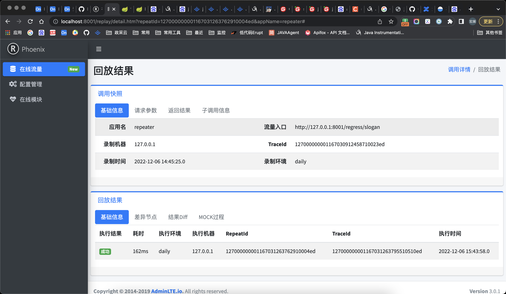

相关命令备忘

```shell
# 将PID为81125的目标进程，attach到sandbox进程
sh ~/sandbox/bin/sandbox.sh -p 81125

# 根据sandbox和java两个关键字查找进程，这里仅输出进程号
ps -ef | grep sandbox | grep java | grep -v grep | awk '{print $2}'
# 根据gs-rest-service和java两个关键字查找进程，这里仅输出进程号
ps -ef | grep gs-rest-service | grep java | grep -v grep | awk '{print $2}'

# 查看repeater日志：
tail -f ~/logs/sandbox/repeater/repeater.log


工程应用：
https://github.com/alibaba/JVM-Sandbox
https://github.com/alibaba/jvm-sandbox-repeater
https://github.com/chenhengjie123/gs-rest-service.git 

参考文档：
https://www.bilibili.com/read/cv6168589
https://www.cnblogs.com/hong-fithing/p/16222644.html
https://segmentfault.com/a/1190000041686449?utm_source=sf-similar-article
```


# 一、录制回放教程

## 1、录制repeater的demo工程

#### 第一步：jvm-sandbox-repeater环境准备

①下载工程：https://github.com/CST11021/jvm-sandbox-repeater.git 
②切换分支：源码工程有bug，需要使用 whz-opt 分支进行打包
③执行工程bin目录下的package.sh脚本，执行命令：sh package.sh
④将打包生成的repeater-stable-bin.tar压缩包解压到 ~/.sandbox-module 目录（如果没有该目录需要创建该目录）

⑤创建一个repeater库，并初始化库表脚本，脚本如下（该脚本在repeater工程的repeater-console-dal模块下的resources目录）：

```sql
create DATABASE IF not EXISTS repeater DEFAULT CHARSET utf8 COLLATE utf8_general_ci;
drop table IF EXISTS record;
create table record (
    id bigint(20) not null AUTO_INCREMENT PRIMARY KEY COMMENT '主键',
    gmt_create datetime not null COMMENT '创建时间',
    gmt_record datetime not null comment '录制时间',
    app_name varchar(255) not null COMMENT '应用名',
    environment varchar(255) not null COMMENT '环境信息',
    host varchar(36) not null COMMENT '机器IP',
    trace_id varchar(32) not null COMMENT '链路追踪ID',
    entrance_desc varchar(2000) not null COMMENT '链路追踪ID',
    wrapper_record longtext not null COMMENT '记录序列化信息',
    request longtext not null COMMENT '请求参数JSON',
    response longtext not null COMMENT '返回值JSON'
) ENGINE = InnoDB COMMENT = '录制信息' DEFAULT CHARSET = utf8 AUTO_INCREMENT = 1;
drop table IF EXISTS replay;
create table replay (
    id bigint(20) not null AUTO_INCREMENT PRIMARY KEY COMMENT '主键',
    gmt_create datetime not null COMMENT '创建时间',
    gmt_modified datetime not null comment '修改时间',
    app_name varchar(255) not null COMMENT '应用名',
    environment varchar(255) not null COMMENT '环境信息',
    ip varchar(36) not null COMMENT '机器IP',
    repeat_id varchar(32) not null COMMENT '回放ID',
    status tinyint not null COMMENT '回放状态',
    trace_id varchar(32) COMMENT '链路追踪ID',
    cost bigint(20) COMMENT '回放耗时',
    diff_result longtext COMMENT 'diff结果',
    response longtext COMMENT '回放结果',
    mock_invocation longtext COMMENT 'mock过程',
    success bit COMMENT '是否回放成功',
    record_id bigint(20) COMMENT '外键'
) ENGINE = InnoDB COMMENT = '回放信息' DEFAULT CHARSET = utf8 AUTO_INCREMENT = 1;
drop table IF EXISTS module_info;
create table module_info (
    id bigint(20) not null AUTO_INCREMENT PRIMARY KEY COMMENT '主键',
    gmt_create datetime not null COMMENT '创建时间',
    gmt_modified datetime not null comment '修改时间',
    app_name varchar(255) not null COMMENT '应用名',
    environment varchar(255) not null COMMENT '环境信息',
    ip varchar(36) not null COMMENT '机器IP',
    port varchar(12) not null COMMENT '链路追踪ID',
    version varchar(128) not null COMMENT '模块版本号',
    status varchar(36) not null COMMENT '模块状态'
) ENGINE = InnoDB COMMENT = '在线模块信息' DEFAULT CHARSET = utf8 AUTO_INCREMENT = 1;
drop table IF EXISTS module_config;
create table module_config (
    id bigint(20) not null AUTO_INCREMENT PRIMARY KEY COMMENT '主键',
    gmt_create datetime not null COMMENT '创建时间',
    gmt_modified datetime not null comment '录制时间',
    app_name varchar(255) not null COMMENT '应用名',
    environment varchar(255) not null COMMENT '环境信息',
    config longtext not null COMMENT '配置信息'
) ENGINE = InnoDB COMMENT = '模块配置信息' DEFAULT CHARSET = utf8 AUTO_INCREMENT = 1;
```


#### 第二步：vm-sandbox工程部署
①下载jvm-sandbox部署包，下载链接：https://github.com/alibaba/jvm-sandbox-repeater/releases/download/v1.0.0/sandbox-1.3.3-bin.tar
②下载后解压到home目录

#### 第三步：启动repeater控制台
①启动jvm-sandbox-repeater控制台：通过whz-opt分支下的com.alibaba.repeater.console.start.Application类启动，启动前需要配置JVM环境变量，在idea中启动配置如下：

```shell
# 注：这里VM options参数，而不是Program arguments
-Xdebug
-Xrunjdwp:transport=dt_socket,server=y,suspend=n,address=8000
-javaagent:${HOME}/sandbox/lib/sandbox-agent.jar=server.port=8820\;server.ip=0.0.0.0
-Dapp.name=repeater
-Dapp.env=daily
```

 

```sh
注：这里也可以直接通过jar包启动，命令如下：
java -jar ~/.sandbox-module/repeater-bootstrap.jar ${JAVA_HOME}/bin/java -Xdebug -Xrunjdwp:transport=dt_socket,server=y,suspend=n,address=8000 \-javaagent:${HOME}/sandbox/lib/sandbox-agent.jar=server.port=8820\;server.ip=0.0.0.0 \-Dapp.name=gs-rest-service \-Dapp.env=daily \-jar gs-rest-service-0.1.0.jar
```

②访问控制台页面: http://localhost:8001/config/list.htm 

 

#### 第四步：添加mock配置

在配置管理添加mock配置并推送到sandbox沙箱，否则无法进行正确的回放：

 

配置内容如下：

```json
{
  "useTtl" : true,
  "degrade" : false,
  "exceptionThreshold" : 1000,
  "sampleRate" : 10000,
  "pluginsPath" : null,
  "httpEntrancePatterns" : [ "^/regress/.*$" ],
  "javaEntranceBehaviors" : [ {
    "classPattern" : "com.alibaba.repeater.console.service.impl.RegressServiceImpl",
    "methodPatterns" : [ "getRegress" ],
    "includeSubClasses" : false
  } ],
  "javaSubInvokeBehaviors" : [ {
    "classPattern" : "com.alibaba.repeater.console.service.impl.RegressServiceImpl",
    "methodPatterns" : [ "getRegressInner", "findPartner", "slogan" ],
    "includeSubClasses" : false
  } ],
  "pluginIdentities" : [ "http", "java-entrance", "java-subInvoke" ],
  "repeatIdentities" : [ "java", "http" ]
}
```

#### 第五步：发起请求并回放

```shell
# 请求业务接口
curl -s 'http://127.0.0.1:8001/regress/slogan'
# 指定录制的TraceId进行请求：
curl -s 'http://127.0.0.1:8001/regress/slogan?Repeat-TraceId=127000000001156034386424510000ed'
# 根据录制的TradeId进行回放：
curl -s 'http://127.0.0.1:8001/regress/slogan?Repeat-TraceId-X=127000000001156034386424510000ed'
```

 

点击回放显示如下：

 


## 2、录制自定义应用

#### 详细步骤如下

```
1.jvm-sandbox-repeater工程打包
	①下载工程：https://github.com/CST11021/jvm-sandbox-repeater.git 
	②切换分支：源码工程有bug，需要使用 whz-opt 分支进行打包
	③执行工程bin目录下的package.sh脚本，执行命令：sh package.sh
	④将打包生成的repeater-stable-bin.tar压缩包解压到 ~/.sandbox-module 目录（如果没有该目录需要创建该目录）

2.下载sandbox部署包，并解压到home目录，下载链接：https://github.com/alibaba/jvm-sandbox-repeater/releases/download/v1.0.0/sandbox-1.3.3-bin.tar

3.启动录制回放控制台：
  ①启动jvm-sandbox-repeater控制台：通过whz-opt分支下的com.alibaba.repeater.console.start.Application类启动
  也可以通过jar包启动：java -jar ${HOME}/.sandbox-module/repeater-bootstrap.jar
  ②访问页面: http://localhost:8001/config/list.htm

4.启动应用进程：
	①执行：java -jar gs-rest-service-0.1.0.jar
	${JAVA_HOME}/bin/java -Xdebug -Xrunjdwp:transport=dt_socket,server=y,suspend=n,address=8000 \
     -javaagent:${HOME}/sandbox/lib/sandbox-agent.jar=server.port=8820\;server.ip=0.0.0.0 \
     -Dapp.name=gs-rest-service \
     -Dapp.env=daily \
     -jar gs-rest-service-0.1.0.jar
     
	②查看应用程序PID：
  ps aux | grep gs-rest-service-0.1.0.jar
  ps -ef | grep gs-rest-service-0.1.0.jar

5.查看日志：tail -f ~/logs/sandbox/repeater/repeater.log

6.配置文件：~/.sandbox-module/cfg/repeater-config.json
{
  "degrade": false, 
  "exceptionThreshold": 1000,
  "httpEntrancePatterns": [
    "^/greeting.*$"
  ],
  "javaEntranceBehaviors": [
  ],
  "javaSubInvokeBehaviors": [
    {
      "classPattern": "hello.GreetingController",
      "includeSubClasses": false,
      "methodPatterns": [
        "greeting"
      ]
    }
  ],
  "pluginIdentities": [
    "http",
    "java-subInvoke"
  ],
  "repeatIdentities": [
    "java",
    "http"
  ],
  "sampleRate": 10000,
  "useTtl": false
}

7.请求：curl -s 'http://localhost:8080/greeting?name=User'
```

#### demo应用的JVM参数配置

```shell
-Xdebug
-Xrunjdwp:transport=dt_socket,server=y,suspend=n,address=8100
-javaagent:${HOME}/sandbox/lib/sandbox-agent.jar=server.port=8820\;server.ip=0.0.0.0
-Dapp.name=gs-rest-service
-Dapp.env=daily
```

#### 测试url

```shell
curl -s 'http://localhost:8080/greeting?name=User'
curl -s 'http://localhost:8080/greeting?name=User&Repeat-TraceId=127000000001166988138778310005ee'
curl -s 'http://localhost:8080/greeting?name=User&Repeat-TraceId-X=127000000001166988138778310005ee'
```

#### 回放配置

注：这里一定要配置才能录制，对应源码的RepeaterConfig类，配置项说明可以参考这个类

```json
{
  "sampleRate": 10000,
  "useTtl": false,
  "degrade": false, 
  "exceptionThreshold": 1000,
  "httpEntrancePatterns": [
    "^/greeting.*$"
  ],
  "javaEntranceBehaviors": [
  ],
  "javaSubInvokeBehaviors": [
    {
      "classPattern": "hello.GreetingController",
      "includeSubClasses": false,
      "methodPatterns": [
        "greeting"
      ]
    }
  ],
  "pluginIdentities": [
    "http",
    "java-subInvoke"
  ],
  "repeatIdentities": [
    "java",
    "http"
  ]
}
```

说明：

```
useTtl：是否开启ttl线程上下文切换，开启之后，才能将并发线程中发生的子调用记录下来，否则无法录制到并发子线程的子调用信息，原理是将住线程的threadLocal拷贝到子线程，执行任务完成后恢复
degrade：是否执行录制降级策略，开启之后，不进行录制，只处理回放请求
exceptionThreshold：异常发生阈值；默认1000，当感知到异常次数超过阈值后，会降级模块
sampleRate：采样率；最小力度万分之一，10000 代表 100%
pluginsPath：插件地址
httpEntrancePatterns：由于HTTP接口的量太大（前后端未分离的情况可能还有静态资源）因此必须走白名单匹配模式才录制
javaEntranceBehaviors：java入口插件动态增强的行为
javaSubInvokeBehaviors：java子调用插件动态增强的行为
pluginIdentities：需要启动的插件
repeatIdentities：回放器插件
```


## 使用Attach方式添加到sandbox

如果目标进程（及业务系统）已经在运行了，可以通过sandbox.sh脚本将sandbox沙箱植入到目标进程中，脚本执行命令如下：

```shell
# 将PID为96750的目标进程，attach到sandbox进程，这里96750为业务系统的进程号
sh ~/sandbox/bin/sandbox.sh -p 96750

# 停止sandbox沙箱进程，关闭后则无法录制
sh ~/sandbox/bin/sandbox.sh -p 96750 -S
```

如果输出如下信息，则说明启动成功，沙箱已经顺利植入了目标JVM中，并完成了底层端口的打开和所有模块的加载。

 

注意：通过attach方式添加目标进程时，目标进程启动时，可以不需要配置-javaagent环境变量，但是仍然需要配置-Dapp.name和-Dapp.env两个环境变量，用来标识系统名称和环境，配置如下：

```shell
# 注：这里VM options参数，而不是Program arguments
-Dapp.name=gs-rest-service -Dapp.env=daily
```

 

否则会出现如下unknown问题：

 

## jvm-sandbox-repeater脚本说明

### bootstrap.sh

说明：

1、kill `repeater-bootstrap.jar` 进程；

2、打包 `jvm-sandbox-repeater` 工程，输出jar包；

3、下载 [sandbox](https://github.com/alibaba/jvm-sandbox-repeater/releases/download/v1.0.0/sandbox-1.3.3-bin.tar) 部署包，并解压到home目录；

4、创建 `~/.sandbox-module` 目录，并复制 `jvm-sandbox-repeater` 工程jar包到该目录；

5、启动home目录下的 `.sandbox-module/repeater-bootstrap.jar` 应用；


### install-local.sh

1、打包 `jvm-sandbox-repeater` 工程，输出jar包；

2、下载 [sandbox](https://github.com/alibaba/jvm-sandbox-repeater/releases/download/v1.0.0/sandbox-1.3.3-bin.tar) 部署包，并解压到home目录；

3、创建 `~/.sandbox-module` 目录；

4、将 `package.sh` 脚本生成的jar包文件copy到 `~/.sandbox-module`


### package.sh

打包如下jar包


### install-repeater.sh

1、下载 [sandbox](https://github.com/alibaba/jvm-sandbox-repeater/releases/download/v1.0.0/sandbox-1.3.3-bin.tar) 部署包，并解压到home目录；

2、下载  [jvm-sandbox-repeater](https://github.com/alibaba/jvm-sandbox-repeater/releases/download/v1.0.0/repeater-stable-bin.tar) 工程部署包（repeater-stable-bin.tar压缩包内容如下），并解压到 `~/.sandbox-module`

 


# 二、JVM-Sandbox用户手册

### 环境要求

1. JDK6+
2. Linux／UNIX／MacOS；暂不支持WINDOWS，主要是一些脚本需要改造

### 安装容器


- **本地安装**

  - 首先需要[下载](http://gitlab.alibaba-inc.com/jvm-sandbox/jvm-sandbox-doc/raw/master/release/sandbox-stable-bin.zip)最新稳定版本

  - 下载完成并解压之后在`./sandbox`目录下执行`./install-local.sh`脚本，指定沙箱的安装目录。我个人喜欢将程序安装在`${HOME}/opt`这个目录下

    ```shell
    ./install-local.sh -p ~/opt
    ```

    如果你能看到以下输出

    ```
    VERSION=0.0.0.i
    PATH=/Users/luanjia/opt/sandbox
    install sandbox successful.
    ```

    恭喜你，安装完成

  - 其实`jvm-sandbox`被设计为不需要安装也能正常执行。沙箱在启动过程中需要定位到配置文件和几个核心JAR包。如果直接运行，则默认的工作目录为`./sandbox`所在目录；安装指定安装目录之后，沙箱脚本的工作目录将为你所指定的安装目录。

### 启动方式

沙箱有两种启动方式：`ATTACH`和`AGENT`

- **ATTACH方式启动**

  即插即用的启动模式，可以在不重启目标JVM的情况下完成沙箱的植入。原理和GREYS、BTrace类似，利用了JVM的Attach机制实现。

  ```shell
  # 假设目标JVM进程号为`2343`
  ./sandbox.sh -p 2343
  ```

  如果输出

  ```
               VERSION : 0.0.0.i
                  MODE : ATTACH
           SERVER_ADDR : localhost
           SERVER_PORT : 49903
        UNSAFE_SUPPORT : ENABLE
          SANDBOX_HOME : /Users/luanjia/opt/sandbox/lib/..
            MODULE_LIB : /Users/luanjia/opt/sandbox/lib/../module
       USER_MODULE_LIB : /Users/luanjia/.sandbox-module
  EVENT_POOL_SUPPORT : ENABLE
  EVENT_POOL_KEY_MIN : 100
  EVENT_POOL_KEY_MAX : 2000
      EVENT_POOL_TOTAL : 3000
  ```

  则说明启动成功，沙箱已经顺利植入了目标JVM中，并完成了底层端口的打开和所有模块的加载。

- **AGENT方式启动**

  有些时候我们需要沙箱工作在应用代码加载之前，或者是更大规模的工程化使用。这就需要启用到`AGENT`的启动方式。

  假设SANDBOX被安装在了`/Users/luanjia/opt/sandbox`，需要在JVM启动参数中增加上

  ```shell
  -javaagent:/Users/luanjia/opt/sandbox/lib/sandbox-agent.jar
  ```

  这样沙箱将会伴随着JVM启动而主动启动并加载对应的沙箱模块。

### 沙箱工程介绍

- **应用目录结构**

  ```
  sandbox/
        +--bin/
        |   +--sandbox.sh
        +--cfg/
        |   +--sandbox-logback.xml
        |   +--sandbox.properties
        |   `--version
        +--lib/
        |   +--sandbox-agent.jar
        |   +--sandbox-core.jar
        |   `--sandbox-spy.jar
        `--module/
            `--sandbox-mgr-module.jar
  ```

  - **./sandbox/bin/sandbox.sh**

    沙箱的客户端脚本，用于启动、管理沙箱

  - **./sandbox/cfg/**

    沙箱配置文件存放目录，里面存放了沙箱的所有配置文件。详细的配置文件清单详解可以参考以下链接

    - [sandbox-logback.xml](#sandbox-logback.xml配置)

    - [sandbox.properties](#sandbox.properties配置)

    - version

    - **./sandbox/lib/**

      沙箱主程序的库包目录，这里存放的是沙箱工程的主程序，不能随意的删除、改名和移动！

      | 文件名            | 作用说明                               |
      | ----------------- | -------------------------------------- |
      | sandbox-agent.jar | 沙箱启动代理                           |
      | sandbox-core.jar  | 沙箱内核                               |
      | sandbox-spy.jar   | 沙箱间谍库<br>用于提供插桩埋点的间谍类 |

  - **./sandbox/module/**

    沙箱系统管理模块目录，沙箱自身提供的各种功能也都是通过模块的形式来完成。

    当前提供了用于模块管理功能的`module-mgr`模块`sandbox-mgr-module.jar`，这个模块非常重要，不要轻易的进行删除。你也可以将自己实现的模块管理功能替换这个管理模块。

    还有更多重要的通用性模块也可以放在此处，但如果和业务相关比较紧密导致需要频繁加载的模块建议是放在`${HOME}/.sandbox-module/`目录下完成。两个目录详细的区别可以见[沙箱模块目录](#沙箱模块目录)

- **日志目录结构**

  沙箱采用的是`logback`日志组件来完成日志记录，日志文件默认写入到`${HOME}/logs/sandbox/sandbox.log`文件中，如果你有需要也可以通过调整`sandbox-logback.xml `文件进行修改日志输出配置。

- **运行时文件**

  沙箱启动后将会创建一个隐藏文件`${HOME}/.sandbox.token`，这个文件将完成目标JVM进程和沙箱客户端进程一些信息的交互

- **<span id="#沙箱的模块目录">沙箱的模块目录</span>**

  沙箱拥有两个加载模块的目录，用途各自不一。

  - `./sandbox/module/`

    沙箱系统模块目录，用于存放沙箱通用的管理模块，比如用于沙箱模块管理功能的`module-mgr`模块，未来的模块运行质量监控模块、安全校验模块也都将存放在此处，跟随沙箱的发布而分发。

    系统模块不受`sandbox.sh`脚本的`-f`、`-F`参数的影响，只有`-R`参数能让沙箱重新加载系统模块目录下的所有模块。

    系统模块不建议频繁重新加载，如果有必要重新加载可以使用`-R`参数

  - `${HOME}/.sandbox-module/`

    沙箱用户模块目录，一般用于存放用户自研的模块。自研的模块经常要面临频繁的版本升级工作，当需要进行模块动态热插拔替换的时候，可以使用`-f`或`-F`参数来完成。

 - **沙箱模块**

   - 所有的沙箱模块都可以被设计成为热插拔

   - 一个JAR包下可以申明多个模块，模块需要符合Java SPI规范，要求

     1. 必须拥有publish的无参构造函数
     1. 必须实现`com.alibaba.jvm.sandbox.api.Module`接口
     1. 必须完成`META-INF/services/com.alibaba.jvm.sandbox.api.Module`文件中的注册（Java SPI规范要求）

   - 同一个JAR包所声明的所有模块共享同一个ModuleJarClassLoader   

   - 模块一共有四种状态

     - 加载

       模块被沙箱正确加载，沙箱将会允许模块正常申请HTTP、WEBSOCKET等资源

      - 卸载

        沙箱不会再看到改模块，之前给该模块分配的所有资源都将会被回收，包括模块已经侦听事件的类都将会被移除掉侦听插桩，干净利落不留后遗症。

       - 激活

         模块加载成功后默认是冻结状态，需要代码主动进行激活。模块只有在激活状态下才能监听到沙箱事件

       - 冻结

         模块进入到冻结状态之后，之前侦听的所有沙箱事件都将被屏蔽。需要注意的是，冻结的模块不会退回事件侦听的代码插桩，只有`delete()`、`wathcing()`或者模块被卸载的时候插桩代码才会被清理。

### 配置文件

- ##### <span id="sandbox-logback.xml配置">sandbox-logback.xml</span>

  沙箱日志框架采用的是LOGBACK日志框架，所以日志的配置文件也直接放开了

  默认的日志是输出到`${HOME}/logs/sandbox/sandbox.log`，当然你也可以根据自己的需要进行调整。

  详细的LOGBACK配置这里不用啰嗦，有需要深入研究的可以参考这个篇博文[logback 常用配置详解（序）logback 简介](http://aub.iteye.com/blog/1101222)

- ##### <span id="sandbox.properties配置">sandbox.properties</span>

  沙箱的系统配置，在这里对沙箱各个系统功能进行开关设置。目前开放的配置项不多，后续随着沙箱功能逐步完善，会有更多的配置选项开放出来。当前还是本着简单就是美的原则来进行设计。

  这里推荐，如果实在没有特殊要求，就尽量用默认值即可。

  | 配置项             | 默认值 | 配置说明                     |
  | ------------------ | ------ | ---------------------------- |
  | unsafe.enable      | TRUE   | 是否允许增强rt.jar的类       |
  | event.pool.enable  | TRUE   | 是否启用事件对象池           |
  | event.pool.key.min | 100    | 事件对象池每个事件最小持有值 |
  | event.pool.key.max | 2000   | 事件对象池每个事件最大持有值 |
  | event.pool.total   | 3000   | 事件对象池总事件持有值       |

  

### 相关命令说明

`sandbox.sh`是整个沙箱的主要操作客户端，当然如果你有兴趣也可以自己写一个脚本来完成，`sandbox.sh`和沙箱主要通过HTTP协议来完成通讯，所以要求Linux系统必须安装`curl`命令。

- `-h`

  输出帮助信息

- `-p`

  指定目标JVM进程号<br>
  操作的时候你只需要指定对应的JVM进程号即可，不用关心底层绑定的沙箱HTTP端口，`sandbox.sh`脚本会帮你搞定这件事

- `-v`

  输出加载到目标JVM中的沙箱版本信息

- `-l`

  列出目标JVM沙箱中已经加载的模块

- `-F`

  强制刷新用户模块(`${HOME}/.sandbox-module/`目录下的模块)。

  - 首先卸载掉所有已加载的用户模块，然后再重新进行加载
  - 当任何一个模块加载失败时，忽略该模块，继续加载其他可加载的模块
  - 模块卸载时将会释放掉沙箱为模块所有的资源

    - HTTP链接
    - WEBSOCKET链接
    - ModuleJarClassLoader
    - 待卸载模块引起的事件插桩

- `-f`

  刷新用户模块，操作步骤如同`-F`参数。但当任何一个模块加载失败时，中断此次刷新操作，当前失败的模块和后续待加载的模块都不会被继续加载。

- `-R`

  沙箱重置，沙箱重置的时候将会强制刷新所有的系统模块`./sandbox/module/`和所有的用户模块`${HOME}/.sandbox-module/`，类似于沙箱系统重启。

- `-u`

  卸载指定模块，支持通配符表达式子。卸载模块不会区分系统模块和用户模块，所有模块都可以通过这个参数完成卸载，所以切记不要卸载了`module-mgr`，否则你将失去模块管理功能。

  > EXAMPLE
  >
  > ```sh
  > # 目标JVM进程号为4321，需要卸载的模块名为`debug-module`
  > ./sandbox.sh -p 4321 -u 'debug-module'
  > 
  > # 也可以使用通配符
  > ./sandbox.sh -p 4321 -u 'debug-*'
  > ```

- `-a`

  激活模块，模块激活后才能收到沙箱事件

- `-A`

  冻结模块，模块冻结后将感知不到任何沙箱事件，但对应的代码插桩还在。

- `-m`

  查看模块详细信息，模块名需要精确匹配，不支持通配符。

  > EXAMPLE
  >
  > ```sh
  > # 目标JVM进程号为4321，需要观察的模块名为`module-mgr`
  > ./sandbox.sh -p 4321 -m 'module-mgr'
  >    ID : module-mgr
  > VERSION : 0.0.0.1
  > AUTHOR : luanjia@taobao.com
  > JAR_FILE : /Users/luanjia/opt/sandbox/lib/../module/sandbox-mgr-module.jar
  > STATE : FROZEN
  >  MODE : {AGENT,ATTACH}
  > CLASS : class com.alibaba.jvm.sandbox.module.mgr.ModuleMgrModule
  > LOADER : ModuleJarClassLoader[crc32=1721245995;file=/Users/luanjia/opt/sandbox/lib/../module/sandbox-mgr-module.jar;]
  >  cCnt : 0
  >  mCnt : 0
  > ```


